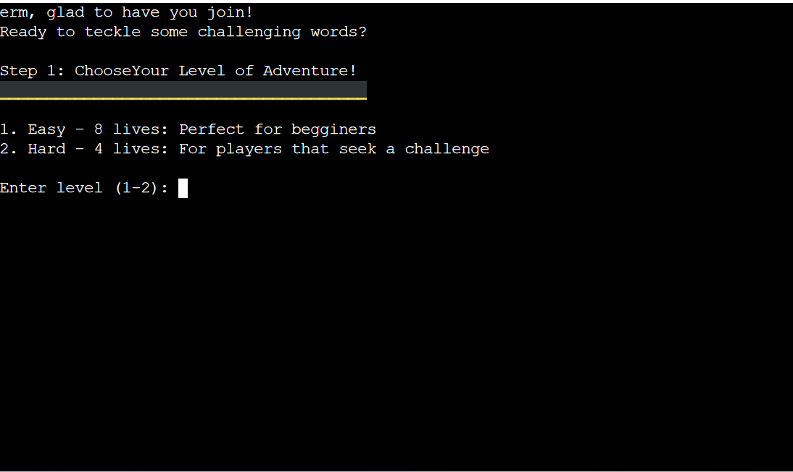
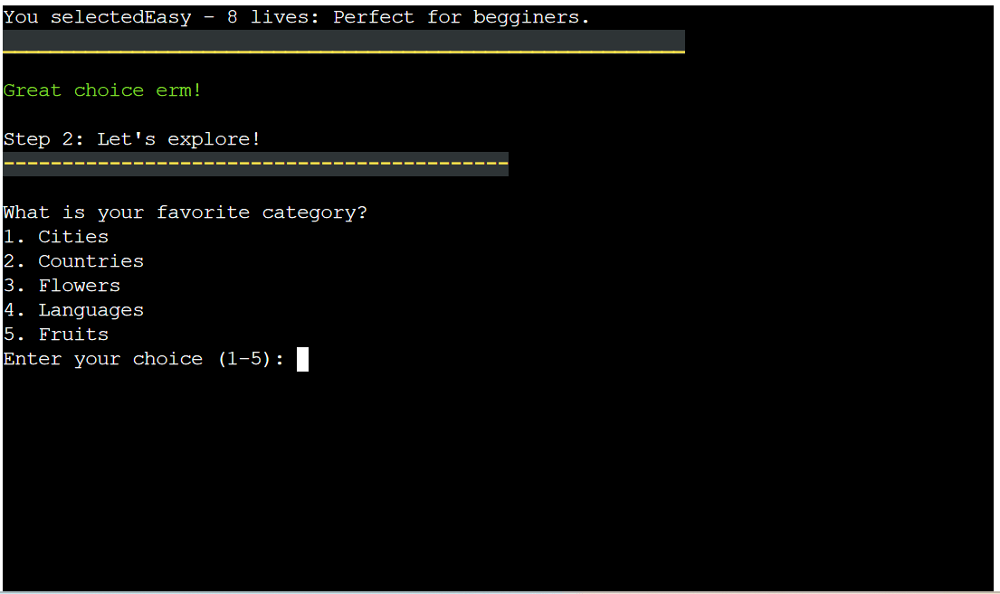
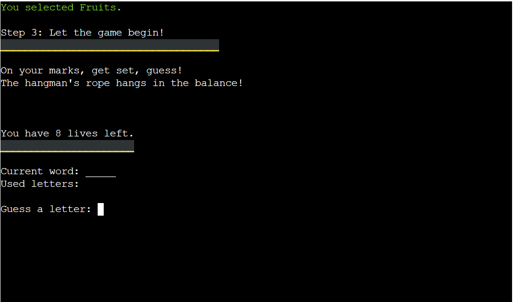
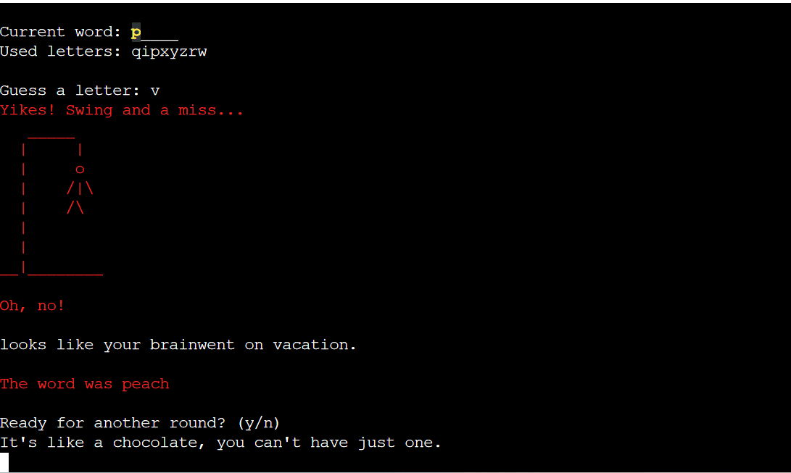
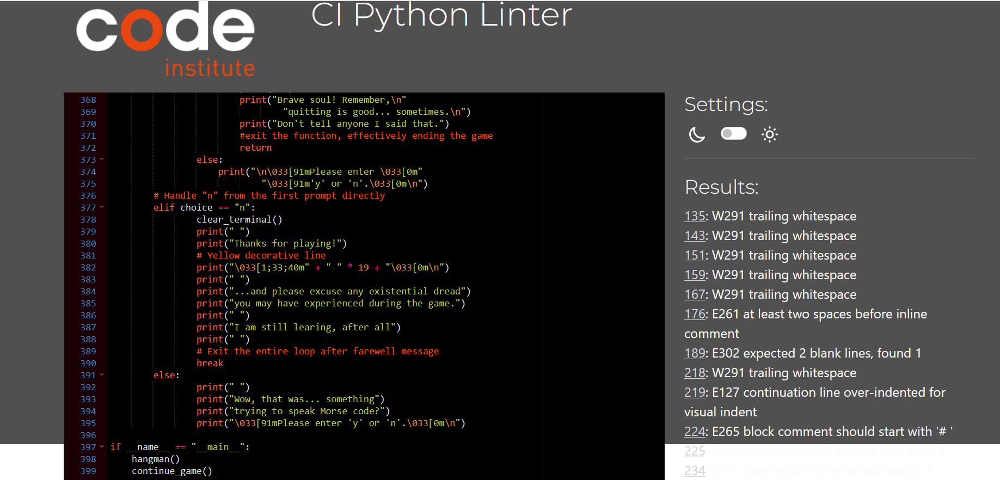
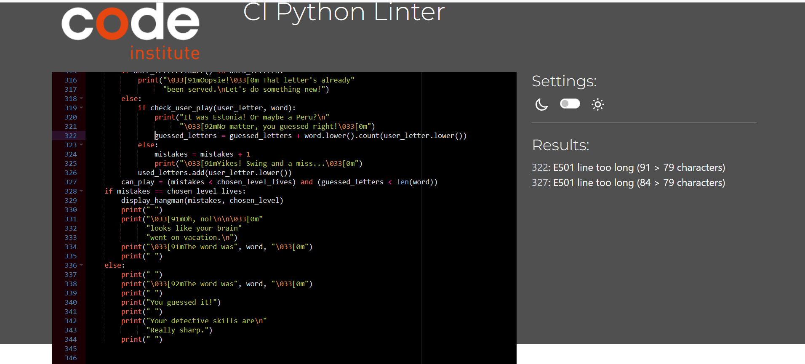
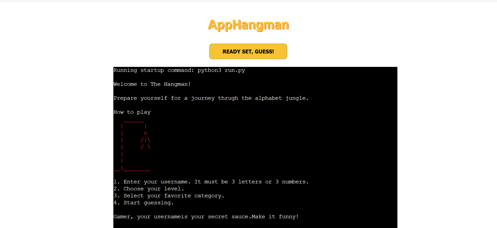
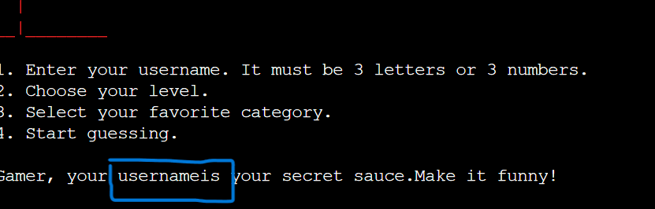

## Welcome to AppHangman game!

This game is perfect game when you feel boring or if you just want to do somethin interesting.
This game contains of two levels. First level is easier and second level is harder. Chosing your level will automacitly bring you to choose your category. There is five categories you can choose from. When you are ready, you can start to test your skills. Game if full of different frases, so don't take it seriously, make it fun and enjoy.

Live link can be found here:

## CONTENT

* [How To Play](#how-to-play)
* [User Stries](#user-stries)
    + [First Time User](#first-time-user)
    + [Returing User](#returing-user)
* [Design](#design)
    + [Layout](#layout)
* [Features](#features)
    + [Welcome](#welcome)
    + [Step 1](#step-1)
    + [Step 2](#step-2)
    + [Step 3](#step-3)
    + [Game Over](#game-over)
* [Technologies Used](#technologies-used)
    + [Languages Used](#languages-used)
    + [Frameworks, Libraries and programs Used](#frameworks-libraries-and-programs-used)
* [Deployment](#deployment)
* [Testing](#testing)
* [Bugs](#bugs)
    + [Solved Bugs](#solved-bugs)
    + [Known Bugs](#known-bugs)
* [Acknowledgments](# acknowledgments)

### How To Play

Press the "Ready, Set, Guess" button to start the game. You will get a welcome message, after that enter your name and it has to be at least 3 letters or numbers. Make it fun!

Feel free to choose your level:
- Easy: 8 lives
- Hard: 4 lives

When you choose your level, you will be able to choose a category that contains 5 options
1. Cities
2. Countries
3. Flowers
4. Languages
5. Fruits

The guessing game will begin and based on your level and your choice you will have 4 or 8 lives. If you guess incorrectly the hangman in red will appear and decrease remaining lives. Correct guess will reveal the letters in right place. The game will end if you run out of lives or if you guess your word correctly. After that you will be able to choose if you want to start over or if you want to end a game. If you choose to end up the game, yu will see a goodbye message. If you change your mind, tou can always restart a game with "Ready, Set Guess" button.

## User Stories

### First Time User
- As a first time user, i want to be able to test my knowledge in different categories and I want to have ability to play a game at anytime and anywhere. I expect the website to adjust to my device's screen size and I want the website to be easy to navigate and allow me to easy choose my level and category. 

### Returning User
- As a returning user I want to be able to choose a hard level and challenge myself as much as possible. I want to be able to get a high score on a hard level and explore different categories and track my progress over time and see how my hangman skills improve everytime I visit a app.

## Design

### Layout
 
The site is a singe page with 5 steps
- Wecme area
- Step 1: is a part where you choose your level
- Step 2: is a part where you exsplore
- Step 3: is a part where your guessing game begin
- Game over

## Features

### Welcome
- In the welcome area users will be able to see a red hangman figure, four steps that describes how to play a game and last step is where they can start a game by pressing a name.

### Step 1
- After users choose username they will be proceed to step 1 of the game where they will be able to choose a level with two options. Option one is easier one and more customized for begginers with eight lives. And option two is harder one where users will have four lives.

### Step 2
- Choosing a level, you will be able to choose a category and you will have five options. Cities, Countries, Flowers, Languages and Fruits. Press a number and start guessing. If you press wrong number, error message will appear on the screen.

### Step 3
- The red hangman bar will appear and everytime you guess wrong letter a line will appear and decrease your number of lives. If you guess right, letter will be placed in a right place.

### Game Over
- When you are done guessing, if you did not make it right, result will show you which word it was and you will have a option to continue if tou want or quit a game. An last but not least you will get game over message.

## Technhngies Used

### Languages Used
- HTML
- CSS
- JavaScript
- Python

### Frameworks Libraries and Programs Used

- [Am I Responsive](https://ui.dev/amiresponsive)
- [Github](https://github.com/)
- [GitPod](https://gitpod.io/)
- [TinyPNG](https://tinypng.com/)
- [Favicon Creator](https://favicon.io/)

## Deployment

This project was deployed using Code Institute's moch termina for Heroku.

These steps were taken for the deployment:
- Create an accound or log in to Heroku.
- On the dashboard, in the right corner click the button "New" and choose "Create New App".
- Pick the name. Unique name is must have because it can match other names.
- Select your region.
- Add payment method if needed.
- Click create app.
- n the menu at the top of the page, go to "Settings Tab"
- Scroll down to Config Vars and click "Reveal Config Vars".
- Add a new Config Vars you will find Buildpacks.
- Click "Add Buildpacks".
- Select Python.
- repeat this step but select Nodejs.
- Important to know: The Python has to be picked before Nodejs, if they are not in a order you can just drag upp so that Python is on a first place.
- Scroll back to the top of the page, click menu and go to Deploy Tab.
- Select GitHub as adeployment method and confirm.
- Search your repository name and connect that.
- Scroll down to the bottom of the page and there you can choose if you want to deploy automaticly or manually.
- Click "View" to see the live site.

## Testing

- While running the code thrught [pep8ci](https://pep8ci.herokuapp.com/) I noticet many bugs. Picture bellow shows unfixed errors:

- However in the second testing majority of the bugs are fixed, but there is one bug that is not possible to fix for one reason. It shows that line is too long, but in order for my code to work, line has to be that length. This bug will be listed in the

## Bugs
### Solved Bugs
- My first bug that is solved is that any word from category was not choosen when game was started.Instead of content inside a category, every category word for example "countries" was chosen.
- Second solved bug is background image that did not show up in the beggining.
- Before:

- After:

- Third bug was that some words were together when they acctually should not be together. Example is shown bellow:

### Known Bugs
- When testing a code in Pep8ci, 2 error appears and those errors describe that line is too long, but those lines has to be long in order to code to work. However I will try my best to expand my knowledge in the python language so that I know how to make a code that accept the amount of characters in that line.

## Acknowledgments
- My mentor Antonio for his help and support and
- Slack community for tips and tricks.

